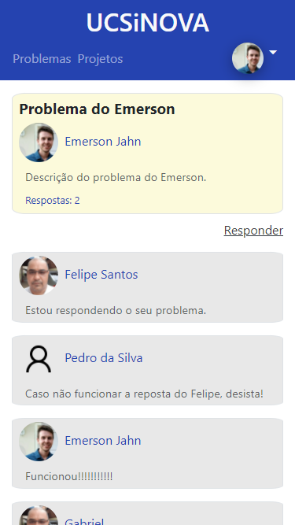

# PlataformasDigitais

## Project developed for the discipline of "Laboratório de Software", from Universidade de Caxias do Sul (UCS), in the semester 01/2021.

 

## Technologies used:
- Angular
- Typescript
- HTML
- PHP
- CSS
- Bootstrap

 

## To run this project you must:
### - Install and configure:
- [Angular] (https://angular.io/)
- [PHP] (https://www.php.net/)
- HTTP Server to run the PHP, like [Apache] (https://httpd.apache.org/)

### Run the project:
Run `ng serve` for a dev server. Navigate to `http://localhost:4200/`. The app will automatically reload if you change any of the source files.

 

## Main screens (All website is responsive :fire:): 
<table border=0>
<tr>
<th colspan=4>
- Login / Sign Up
</th>
</tr>
<td>

</td>
<td>

</td>
</tr>
<tr>
<th colspan=4>
- Problems
</th>
</tr>
<tr>
<td>

</td>
<td>

</td>
<td>

</td>
</tr>
<tr>
<th colspan=4>
- Projects
</th>
</tr>
<tr>
<td>

</td>
<td>

</td>
<td>

</td>
<td>

</td>
</tr>
</table>

 
 

## Developed by

<table border=0>
<tr>
<td>
<a href="https://github.com/EmersonJahn">

 
<b>Emerson Jahn</b></a> 

 
 
 

</td>
</tr>
</table>

 

## Colaborators

<table border=0>
<tr>
<td>
<a href="https://github.com/vbcomin">

 
<b>Victor Comin</b></a> 
</td>
<td>
<a href="https://github.com/gugagobbato">

 
<b>Gustavo Gobbato</b></a> 
</td>
</tr>

</table>

